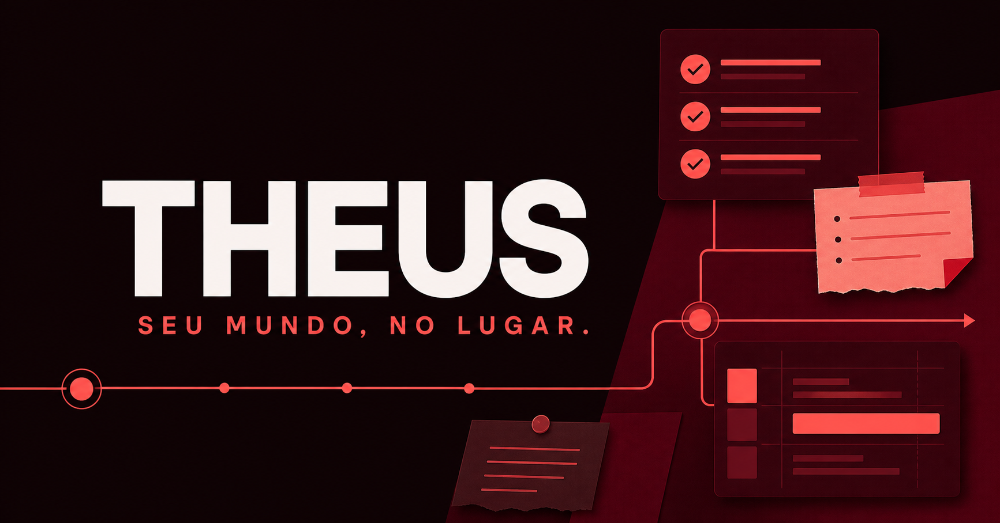
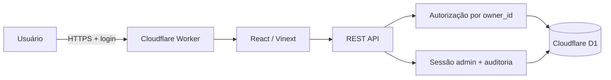

# THEUS — organizador pessoal full-stack

[](https://github.com/hashickzvictorhugo/Sistema-de-Agendamento-Agenda-Theus/actions/workflows/ci.yml)
[](https://github.com/hashickzvictorhugo/Sistema-de-Agendamento-Agenda-Theus/actions/workflows/codeql.yml)
[](https://www.typescriptlang.org/)
[](https://theus-organizador.duraesalvesvictorhug.chatgpt.site)

> Tarefas, notas e compromissos em um único espaço, com autenticação,
> isolamento entre contas e um painel administrativo protegido.

[**Abrir demonstração**](https://theus-organizador.duraesalvesvictorhug.chatgpt.site) ·
[**Arquitetura**](docs/architecture.md) ·
[**Segurança**](docs/security.md)



## O problema

Informações pessoais costumam ficar divididas entre lista de tarefas, agenda e
aplicativo de notas. O THEUS reúne esses três fluxos numa experiência responsiva
e mantém cada registro associado à identidade autenticada no servidor.

O projeto foi construído como um produto SaaS pequeno, não apenas como uma tela:
possui regras de negócio, API, banco relacional, migrations, proteção entre
contas, auditoria, testes comportamentais, CI e deploy serverless.

## Recursos

- painel diário com foco sugerido, progresso e busca global;
- tarefas com prioridade, prazo e fluxo `a fazer → fazendo → concluída`;
- notas fixáveis e compromissos com local, início, término e dia inteiro;
- interface desktop/mobile com estados vazios, carregamento e erros;
- Sign in with ChatGPT e dados isolados por usuário;
- painel administrativo somente leitura, exclusivo do proprietário;
- sessão administrativa curta, assinada, persistida e revogável;
- trilha de auditoria e limitador de tentativas resistente a concorrência.

## Stack e decisões

| Camada | Tecnologia | Motivo |
| --- | --- | --- |
| Interface | React 19 + TypeScript | componentes tipados e renderização híbrida |
| Aplicação | App Router via Vinext | páginas e APIs no mesmo produto |
| Runtime | Cloudflare Workers | execução serverless próxima ao banco |
| Dados | D1 / SQLite + Drizzle ORM | migrations versionadas e SQL relacional |
| Identidade | Sign in with ChatGPT | autenticação gerenciada pela plataforma |
| Qualidade | Node 24, ESLint, TypeScript e Node Test Runner | pipeline reproduzível sem framework de teste pesado |
| Entrega | GitHub Actions + Sites | validação automática e deploy versionado |



A decisão e seus trade-offs estão registrados no
[`ADR 0001`](docs/adr/0001-vinext-on-workers.md).

## Segurança

- autorização do proprietário pelo ID estável fornecido pela plataforma;
- `owner_id` derivado no backend — nunca aceito do cliente;
- senha administrativa com PBKDF2-HMAC-SHA256 e custo mínimo de 600 mil;
- no máximo cinco verificações por janela, reservadas atomicamente no D1;
- cookie `__Host-`, `HttpOnly`, `Secure`, `SameSite=Strict` e validade de 15 min;
- nonce de sessão persistido e revogado no logout;
- origem idêntica obrigatória em toda mutação;
- CSP, HSTS, `nosniff`, bloqueio de frames e respostas privadas sem cache;
- segredos somente no ambiente de execução.

O modelo de ameaça, as garantias e as limitações estão em
[`docs/security.md`](docs/security.md). Relatos devem seguir o
[`SECURITY.md`](SECURITY.md).

## Testes e qualidade

O pipeline executa:

```bash
npm run lint
npm run typecheck
npm run build
npm run test:unit
```

Os testes não procuram apenas strings no código. Eles exercitam o artefato
renderizado e comportamentos de segurança com SQLite em memória:

- hash correto, entradas inválidas e comparação exata da senha;
- allowlist pelo identificador estável;
- assinatura, vínculo, adulteração e revogação da sessão;
- limite atômico sob tentativas paralelas;
- isolamento dos agregados administrativos;
- política de origem que falha de forma fechada.

CodeQL analisa JavaScript/TypeScript e o Dependabot acompanha dependências e
GitHub Actions.

## Executando localmente

Requisitos: Node.js `>=22.13` (Node 24 é usado em CI).

```bash
git clone https://github.com/hashickzvictorhugo/Sistema-de-Agendamento-Agenda-Theus.git
cd Sistema-de-Agendamento-Agenda-Theus
npm ci
npm run dev
```

Crie um `.env` local a partir de `.env.example`:

```dotenv
ADMIN_OWNER_USER_ID=
ADMIN_PASSWORD_HASH=
ADMIN_SESSION_SECRET=
```

Valores reais nunca devem ser adicionados ao Git. O banco é declarado como
`DB` em `.openai/hosting.json`; schema e migrations ficam em `db/` e `drizzle/`.

## Estrutura

```text
app/        páginas, componentes e rotas REST
db/         schema, consultas e isolamento de dados
drizzle/    migrations SQLite versionadas
lib/        autenticação, validação e tipos de domínio
tests/      smoke tests e testes comportamentais de segurança
worker/     entrada Cloudflare e cabeçalhos HTTP
docs/       arquitetura, segurança e decisões técnicas
```

## Roadmap honesto

- [ ] quotas por usuário e paginação por cursor;
- [ ] separar o componente principal por domínio (`tasks`, `notes`, `calendar`);
- [ ] exportação de dados e operações idempotentes;
- [ ] fluxo E2E no navegador com dados fictícios;
- [ ] observabilidade com métricas de produto sem conteúdo pessoal.

## Processo e autoria

O desenvolvimento contou com apoio de IA para acelerar implementação e revisão.
As decisões, riscos, migrations e validações estão documentados no repositório;
o código não trata geração automática como substituto para testes ou domínio do
problema.

---

Desenvolvido por [Victor Hugo Durães](https://github.com/hashickzvictorhugo).
