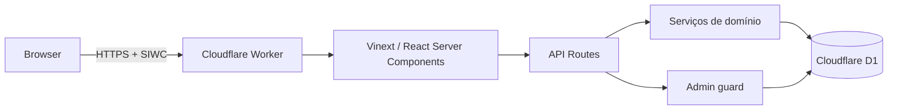

# Arquitetura

## Visão geral

O Worker encerra TLS e aplica cabeçalhos de segurança. O Vinext entrega a
landing pública, inicia o fluxo de autenticação gerenciado pela plataforma e
renderiza o aplicativo. Rotas de API recuperam a identidade no servidor e
nunca aceitam `ownerId` enviado pelo cliente.

## Persistência

O D1 mantém tarefas, notas, compromissos, tentativas administrativas, auditoria
e sessões revogáveis. Todos os registros de produto possuem `owner_id`; os
índices foram desenhados para os filtros de proprietário, status e data usados
na aplicação.

## Fronteiras

- `app/`: páginas, componentes e rotas HTTP;
- `lib/`: validação, autenticação e tipos de domínio;
- `db/`: schema e consultas com isolamento por proprietário;
- `worker/`: entrada Cloudflare e cabeçalhos de segurança;
- `tests/`: smoke tests do build e testes comportamentais de segurança.

## Trade-offs

- Vinext permite executar a experiência de App Router em Workers, mas ainda é
  beta; o risco é controlado por versões fixadas, build em CI e smoke tests.
- A sessão administrativa continua curta mesmo sendo revogável, reduzindo o
  impacto de um cookie capturado.
- O painel administrativo é deliberadamente somente leitura nesta versão.
